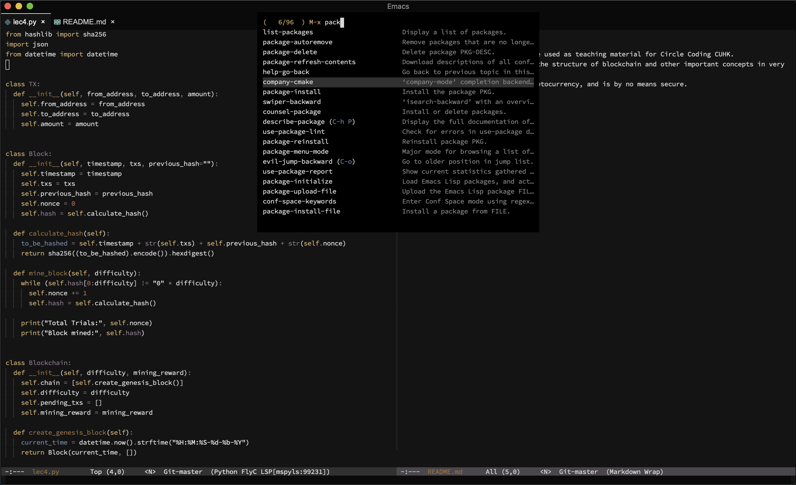
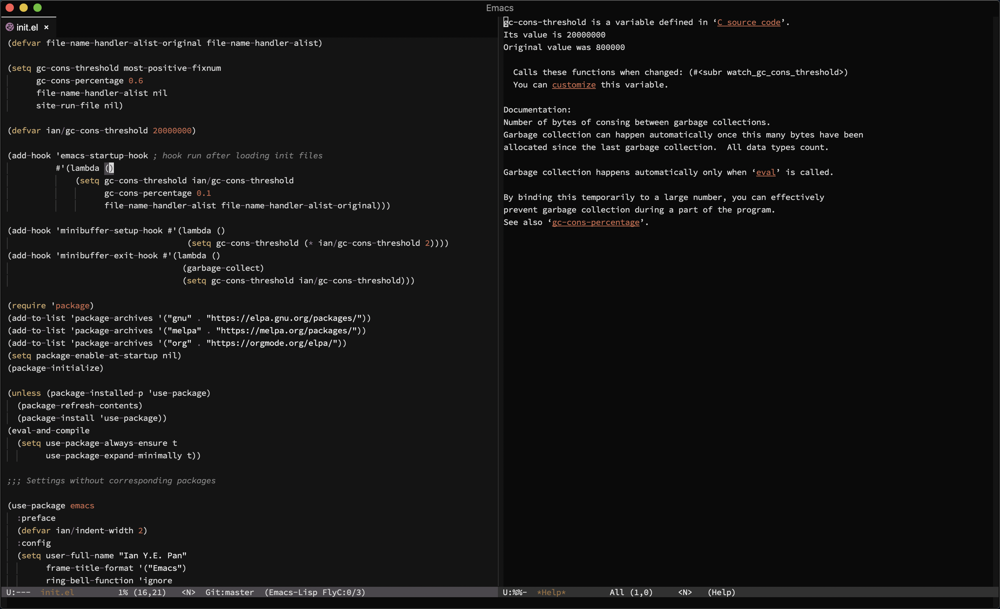

<h3 align="center">Wilmersdorf Emacs Theme</h3>
<hr/>


<p align="center">

</p>

<p align="center">
<a href="https://github.com/ianpan870102/wilmersdorf-emacs-theme"></a>
<a href="https://www.gnu.org/licenses/gpl-3.0"></a>
</p>

<br/>

<p align="center">A comprehensive port of the classic Twilight coding theme</p>

<br/>
<br/>

#### Installation: manual install

Download `twilight-theme.el` and put it under `~/.emacs.d/themes/` (or `~/.config/emacs/themes/`), then add these lines to your `init.el`:

```
(add-to-list 'custom-theme-load-path "~/.emacs.d/themes/")
# or
(add-to-list 'custom-theme-load-path "~/.config/emacs/themes/")

(load-theme 'twilight t)
```

#### Screenshots






Copyright© 2019 Ian Y.E. Pan

This program is free software: you can redistribute it and/or modify it under the terms of the GNU General Public License as published by the Free Software Foundation, either version 3 of the License, or (at your option) any later version.

This program is distributed in the hope that it will be useful, but WITHOUT ANY WARRANTY; without even the implied warranty of MERCHANTABILITY or FITNESS FOR A PARTICULAR PURPOSE. See the GNU General Public License for more details.

You should have received a copy of the GNU General Public License along with this program. If not, see https://www.gnu.org/licenses/.
